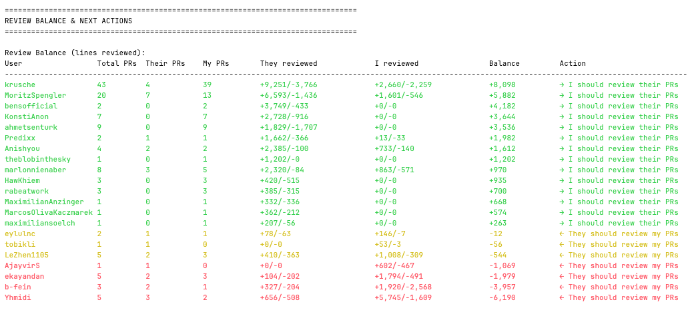
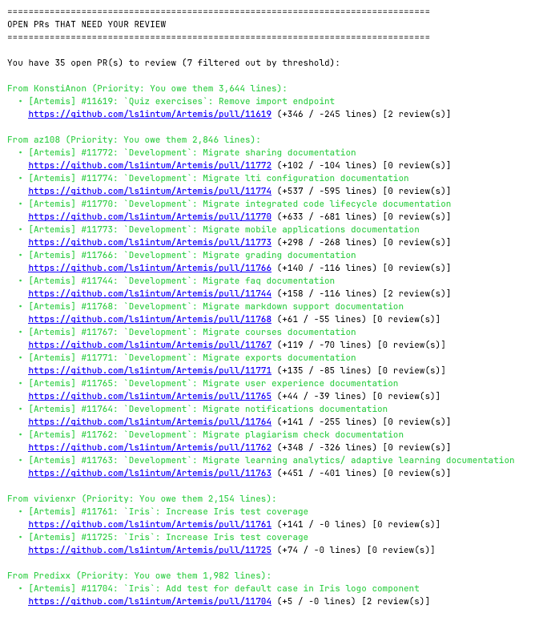

# GitHub PR Review Analyzer

A Python script to analyze GitHub pull request review activity between you and other contributors.

## Features

- 📊 Track PRs you reviewed vs. PRs others reviewed for you
- 📈 Calculate lines of code reviewed in both directions
- 🔢 Count review events (approvals, change requests)
- ⚖️ Calculate review balance (offset) between users
- 🔀 Sortable review balance table by different columns
- 💾 Caching to speed up subsequent runs
- 🔓 Includes open (unmerged) PRs in analysis
- 📝 List all reviewed PRs with clickable links

## Output

The script generates both **console output** and an **interactive HTML report** with color-coded sections for easy readability.

### HTML Report

The tool automatically generates an interactive HTML report saved to your current directory with a filename like `github_review_analysis_<username>_<timestamp>.html`. This report includes:

- **Interactive sortable tables** - Click column headers to sort by different metrics
- **Clickable rows** - Click on a user to jump to their open PRs
- **Collapsible sections** - Expand/collapse detailed information as needed
- **Copy-to-Slack buttons** - One-click copying of formatted review request messages
- **Visual feedback** - Color-coded priorities and review balances
- **Review history** - Detailed per-user review metrics and PR lists

### 1. Review Balance Table



The review balance table shows:
- Total PR interactions with each collaborator
- Lines reviewed in both directions (with +additions/-deletions breakdown)
- Review balance and recommended next actions
- Click any user to jump to their open PRs

### 2. My Open PRs Needing Review

A collapsible section showing your open PRs with:
- **Two buttons per PR**: One for code review requests, one for testing requests
- **Slack-ready messages**: Click to copy formatted messages to your clipboard
- **PR metrics**: Line changes, repository info, and direct links

### 3. Open PRs That Need Your Review



Shows PRs awaiting your review, grouped by author with:
- **Priority indicators**: Based on your review balance with each author
- **Review status badges**: Shows review count, changes requested, etc.
- **Personalized messages**: Click to copy a customized Slack review request for each author
- **Review history**: Expandable section showing your past interactions with each author

### 4. Deep dive per collaborator
- Complete metrics: PRs reviewed, lines reviewed, review events, comments
- Full list of PRs you reviewed with titles and links
- Full list of PRs they reviewed with titles and links
- Expandable sections to keep the report clean and focused

## Prerequisites

- Python 3.7+
- `requests` library
- GitHub Personal Access Token (recommended for higher rate limits)

## Installation

1. Install required dependencies:
    ```bash
     pip install -r requirements-review-analyzer.txt
    ```
   
2. Create env file (optional but recommended)

    ```bash
    cp .env.example .env
    ```

3. Replace the placeholders in the `.env` file

## Usage

### Environment Variables

You can configure the script using environment variables in your `.env` file:

- `GITHUB_USERNAME`: Your GitHub username
- `GITHUB_TOKEN`: Your GitHub personal access token
- `GITHUB_REPOS`: Comma-separated list of repositories (e.g., `owner/repo1,owner/repo2`)
- `ANALYSIS_MONTHS`: Number of months to analyze (default: 3)
- `EXCLUDED_USERS`: Comma-separated list of users to exclude from analysis
- `USE_CACHE`: Enable/disable caching (default: true)
- `SORT_BY`: Column to sort the review balance table by (default: total_prs)
- `SHOW_EXTENDED_REPORT`: Show detailed review history per user (default: false)
- `SHOW_OVERALL_STATISTICS`: Show overall statistics section (default: true)
- `MAX_REVIEW_COUNT_THRESHOLD`: Filter out PRs with N or more reviews from the open PRs list (default: no filtering)
- `FILTER_NON_PR_AUTHORS`: Filter out users who have not opened any PRs (default: true)

### How to Run The script

Simply run the script and follow the prompts (or provide parameters via `.env` file):

```bash
python3 github-review-analyzer.py
```

The script will:
1. Analyze your PR review activity
2. Display a summary in the console
3. **Generate an HTML report** saved to the current directory
4. Print the path to the HTML file for easy access

Open the generated HTML file in your browser to access the full interactive report with sortable tables, collapsible sections, and copy-to-Slack functionality.

## Configuration Options

### Environment Variables

You can configure the script using environment variables in your `.env` file:

- `GITHUB_USERNAME`: Your GitHub username
- `GITHUB_TOKEN`: Your GitHub personal access token
- `GITHUB_REPOS`: Comma-separated list of repositories (e.g., `owner/repo1,owner/repo2`)
- `ANALYSIS_MONTHS`: Number of months to analyze (default: 3)
- `EXCLUDED_USERS`: Comma-separated list of users to exclude from analysis
- `USE_CACHE`: Enable/disable caching (default: true)
- `SORT_BY`: Column to sort the review balance table by (default: total_prs)
- `SHOW_EXTENDED_REPORT`: Show detailed review history per user (default: false)
- `SHOW_OVERALL_STATISTICS`: Show overall statistics section (default: true)
- `MAX_REVIEW_COUNT_THRESHOLD`: Filter out PRs with N or more reviews from the open PRs list (default: no filtering)
- `FILTER_NON_PR_AUTHORS`: Filter out users who have not opened any PRs (default: true)

### Extended Report

By default, the script outputs a concise report showing only the review balance table, open PRs, and overall statistics. To see the detailed review history section with per-user breakdowns of all reviewed PRs, you can enable the extended report:

```bash
# Enable extended report for a single run
SHOW_EXTENDED_REPORT=true python3 github-review-analyzer.py

# Or in your .env file
SHOW_EXTENDED_REPORT=true
```

The extended report includes:
- Detailed metrics table for each collaborator
- Complete list of PRs you reviewed for them with links
- Complete list of PRs they reviewed for you with links
- Line review offset calculations per user

This is useful for in-depth analysis but can make the output quite long if you have many collaborators.

### Overall Statistics

By default, the script displays an overall statistics section at the end showing aggregate metrics across all collaborators. To hide this section and make the output more concise, you can disable it:

```bash
# Disable overall statistics for a single run
SHOW_OVERALL_STATISTICS=false python3 github-review-analyzer.py

# Or in your .env file
SHOW_OVERALL_STATISTICS=false
```

The overall statistics section includes:
- Total number of PRs you reviewed
- Total number of PRs others reviewed for you
- Total lines reviewed (with separate additions and deletions)
- Number of collaborators

This is useful if you only want to focus on the per-user review balance and open PRs without the aggregate summary.

### Review Count Threshold Filtering

You can configure the tool to filter out PRs from the "Open PRs That Need Your Review" section based on how many reviews they've already received. This is useful when you want to focus on PRs that haven't gotten much attention yet.

**Key Features:**
- PRs with N or more reviews will be hidden from the open PRs list
- **Exception**: PRs that explicitly requested your review will ALWAYS be shown, regardless of review count
- The filter displays how many PRs were filtered out
- Color coding (green/yellow/red) is applied based on review balance with each author

Example usage:

```bash
# Only show PRs with fewer than 2 reviews (unless you were requested)
MAX_REVIEW_COUNT_THRESHOLD=2 python3 github-review-analyzer.py

# Or in your .env file
MAX_REVIEW_COUNT_THRESHOLD=2
```

**Example output:**

In the HTML report, filtered PRs are shown at the top of the "Open PRs That Need Your Review" section with clear indicators:
- Green-highlighted PRs indicate you owe them reviews (positive balance)
- Priority messages show the line count balance
- Badges indicate review count, requested reviews, and changes requested
- Each PR has buttons to copy personalized Slack review requests

### Table Sorting

The review balance table can be sorted by different columns using the `SORT_BY` environment variable. Available options:

- `total_prs` (default): Total number of PRs reviewed between you and each user
- `balance`: Review balance (positive = you reviewed more of their code, negative = they reviewed more of yours)
- `user`: Username (alphabetically)
- `they_reviewed`: Total lines they reviewed of your code
- `i_reviewed`: Total lines you reviewed of their code
- `their_prs`: Number of their PRs you reviewed
- `my_prs`: Number of your PRs they reviewed

Example usage:

```bash
# Sort by review balance to see who you owe reviews to
SORT_BY=balance python3 github-review-analyzer.py

# Sort alphabetically by username
SORT_BY=user python3 github-review-analyzer.py

# Or in your .env file
SORT_BY=balance
```

### Caching

The script automatically caches API responses to `.github_review_cache.json` in the current directory. This significantly speeds up subsequent runs by avoiding redundant API calls.

#### Cache Features

- **Automatic**: Caching is enabled by default
- **Smart PR-state aware**: Only caches data for closed PRs (open PRs always fetch fresh data)
- **Permanent**: Cache entries never expire (closed PRs don't change)
- **Selective**: Only fetches new data when not in cache
- **Persistent**: Cache is saved to disk and reused across runs indefinitely

#### Cache Control

To disable caching, set the `USE_CACHE` environment variable:

```bash
# Disable caching for a single run
USE_CACHE=false python3 github-review-analyzer.py

# Or in your .env file
USE_CACHE=false
```

To clear the cache, simply delete the cache file:

```bash
rm .github_review_cache.json
```

## Rate Limits

- **Without token**: 60 requests/hour
- **With token**: 5,000 requests/hour

Using a token is highly recommended for analyzing repositories with many PRs.

## Notes

- The script tracks additions (+lines) and deletions (-lines) separately and also shows the total
- Fetches full PR details to ensure accurate line counts
- Both open and closed PRs are included in the analysis
- Only closed PRs are cached; open PRs always fetch fresh data to reflect ongoing changes
- Cached data never expires since closed PR data is immutable
- You can exclude specific users (e.g., bots like dependabot) from the analysis
- Review events include approvals, change requests, and dismissals
- Comments include both review comments and general PR comments
- PRs are filtered by creation date within the specified time range
- The script handles pagination automatically for repositories with many PRs

## Troubleshooting

### Rate Limit Exceeded
```
Error: Rate limit exceeded
```
**Solution**: Use a GitHub Personal Access Token

### Missing Reviews
If you notice missing review data, ensure:
- The time range is appropriate
- You have access to the repository
- The PRs were created within the specified time range

## Testing

For comprehensive testing instructions, see the [Testing Guide](TESTING.md).

### Quick Start

1. Install development dependencies:
   ```bash
   pip install -r requirements-dev.txt
   ```

2. Run all tests:
   ```bash
   pytest tests/ -v
   ```

3. Run tests with coverage report:
   ```bash
   pytest tests/ --cov=src --cov-report=term-missing
   ```
